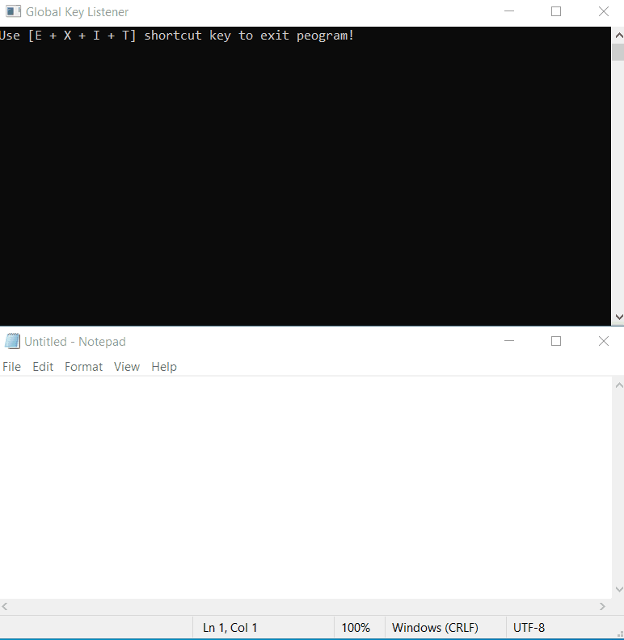
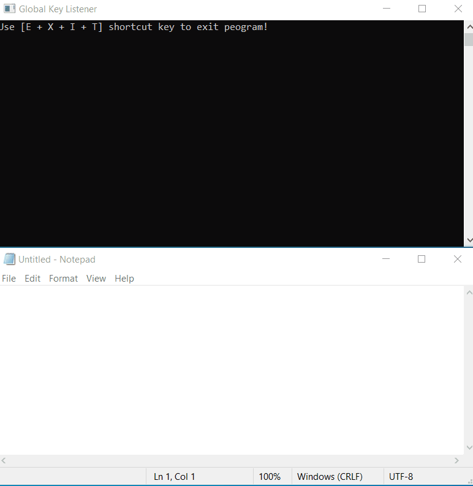

# GlobalKeyListener
A simple C# script to listen global key input. This technique does not use hooks. It also supports custom shortcut keys.

# Features
- Listens to global keystrokes. Use KeyDown and KeyUp events. (cannot listen from an application that has higher privilege)
- Converts keystroke to its corresponding character. Use OnKeyPress event.
- Supports defining custom shortcut keys. 

# Keystrokes Example
```
GlobalKeyListener listener = new GlobalKeyListener();
listener.OnKeyPressed += (Keys k, char c) =>
{
    if (c >= 32 && c <= 126)
        Console.Write(c);
    else if (k == Keys.Return)
        Console.WriteLine();
    else if (k == Keys.Back)
        Console.Write("\b \b");
    else if (k == Keys.Tab)
        Console.Write("\t");
};
listener.Start();
```


# Custom Shortcut Keys
```
GlobalKeyListener listener = new GlobalKeyListener();
ShortcutListener shorcut = new ShortcutListener(listener, new Keys[] { Keys.E, Keys.X, Keys.I, Keys.T });
shorcut.OnActivated += () => isRunning = false;
listener.Start();
```

